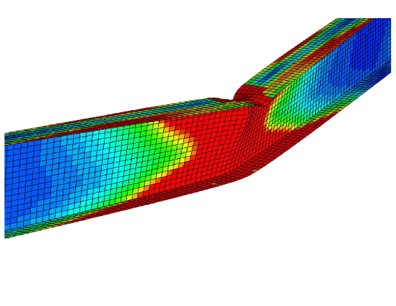

# SAMPE Beam Design

The SAMPE organization holds an annual contest for composite material beams.

Previous beam dimensions and test data was compiled in order to write a MATLAB script that predicts the maximum load a beam could sustain. The script computes the moment of inertia and maximum normal stress, then, using the beam’s dimensions, solves for the theoretical load. A visualization of the results of the finite element analysis for I-Beam can be seen below.

